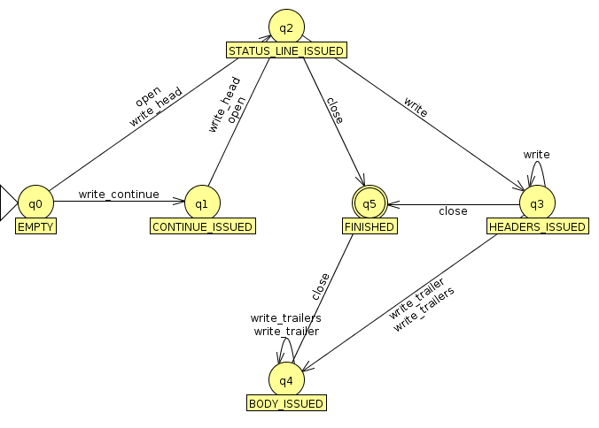

# HTTP server on boost

## Goals

* Develop a library for Boost submission and inclusion that abstracts HTTP
  (**server** **side**).
* Asynchronous design that provides scalability.
* Modular design that doesn't force all abstractions to be used together.
  * The main goal of the modular design is to fit well in embeded projects
    developed for resource-constrained devices while it still provide the
    possibility and some abstractions for better performance on devices not so
    constrained, such as pools to recycle objects and threaded versions that can
    (mostly) cooperate with the same interfaces.
* Expose the HTTP power.
  * Chunked entities. A stream interface that allow live-stream.
  * 100-continue status. A feature to reduce network consumption.
  * Upgrade support. A feature required for WebSocket.
* Allow multiple backends such as FastCGI and CoAP. It will be useful also for
  HTTP 2.0. The only backend implementation developed will be the built in
  server (see the _deliverables_ section for more details).

## Non-goals

* Provide lower abstractions to the HTTP parser.
  * This project will use ready HTTP parsers, then I'll be free to focus on
    other important features.
  * It can be replaced later, because the parser interface will not be exposed
    and it won't affect code that makes use of this library.
* Provide even higher-abstractions to write template-driven MVC web applications
  quickly.
  * But it'll be possible to build such abstractions on top of the developed
    library.
  * In fact, there are a lot of higher-level abstractions competing with each
    other, providing mostly incompatible abstractions. By not targeting this
    field, this library can actually become a new base for all these
    higher-level abstractions and allow greater interoperability among them.

## Some target scenarios

I've wrote this section several times, but Bjorn Reese put into better words
than me, then I'll quote it.

> 1. Targets embeddable HTTP servers (e.g. to implement ReST APIs).
>    These servers should be able to co-exist with other embeddable
>    communication facilities (e.g. Bonjour device discovery or
>    BitTorrent.)
> 2. Create a C++ toolbox for embeddable HTTP servers.
>    This requires a modular design and a coherent thread model.
> 3. Flexible design that can encompass HTTP chunking, HTTP pipelining,
>    WebSockets, FastCGI, etc.
> 4. Scalable performance.
>    This requires an asynchronous design.
> 5. Reuse existing std or Boost components, such as Boost.Asio.

-- Bjorn Reese, [on the boost mailing list](
http://lists.boost.org/Archives/boost/2014/03/212072.php)

## Design considerations

The idea in this initial proposal is to implement a core library which is useful
and can work on projects which require low-overhead implementation. What I mean
by low-overhead is that the library won't force you to use abstractions that
your project doesn't need or cannot afford. This is achieved through a modular
design. You don't need a request router if the only purpose of your project is
to stream some video being captured at realtime, for instance.

Another design decision of the design is to go full async, but also allow
threads, then you can mirror the successful design of the [Monkey HTTP Daemon](
http://monkey-project.com/), where you have multiple requests per event loop and
one event loop per thread. Again, the design is not all-or-nothing and if you
don't want to, this library won't force you to use threads.

Any proposal submitted to be part of standard libraries (or general ones like
boost) should, obviously, be general and usable by projects with different
requirements. One example of the difficulties in such challenge, within this
proposal, is a collection of cache and pool objects, which can improve the
performance of big-scale applications, but might increase the memory-overhead in
embedded applications to the point where it becomes a non-solution.

The design should allow the programmer to pick the interesting pieces and glue
them together to fit in his project.

The non-intrusive and modular design choices don't come for free. Now, everytime
you're going to write a web application for your company, you'll probably be
writing the same skel code to setup the http server, the session store objects,
the request handler dispatching/router and the glue among them. Fortunately, (1)
the boilerplate is very small, (2) it's possible to go from non-intrusive design
to the intrusive design (the opposite is not that easy, though) and (3) it's
possible to provide minimal project examples that could be used as templates for
the user. One example by what I mean with #2 is to provide an even higher
abstraction that will assume that the user wants to use a common set of
components and provide a less verbose interface, but this higher-level
abstraction requires a core library first and is outside of the scope of this
proposal.

The only requirement/intrusiveness of the library, ideally, should be an async
programming model, but this only affect programming tastes and doesn't imply
that the library cannot be used in certain devices or clusters.

The only feature that should include an overhead in the proposal is the
decoupling of HTTP messages and HTTP connections (the HTTP parser). HTTP
messages should be feeded by producer backends that could implement different
communications such as a builtin HTTP server, a FastCGI receiver and others.
The cited overhead is only one level of indirection and should be very small. To
provide the same functionality, one pure C API would need to add this small
overhead too. Also, this design brings large benefits that easily overcome the
added overhead concern, such as:

* Obviously, HTTP messages are not tied to HTTP connections anymore.
  * Now it's easier to apply a finer-grained threaded request dispatch where you
    can detect very busy threads by the amount of messages and not by the amount
    of connections. Of course I want something even clever while things are
    still kept simple, but let's discuss this later.
* CGI/FastCGI, HTTP/2.0 and limitless others without breaking the logic of the
  handlers created by the application programmer.
* HTTP pipelining is easier to implement (for me and for the user of the
  library).
* There are other nice implications, but I want to detail this later.

### SG4

SG4 is the name of the [responsible working group for networking within the
next C++ standard](http://isocpp.org/std/the-committee). Some of their proposals
are related to abstractions that ASIO already provides, such as representation
for IP addresses. There are also proposals that aren't directly interesting for
this proposal, but there is also one interesting proposal that may
affect/inspire the design documented here. This interesting proposal is the
N3625, which documents an URI library for C++.

There is a [standalone version of the URI library at github](
https://github.com/cpp-netlib/uri). Details about how this document/library
impacts this proposal will be found below, where appropriate. Currently there is
no need to make use of this proposal or to mirror it in boost, but this feeling
might change later.

<!-- if proposal becomes too greedy and requires a ready uri implementation:

The general plan is to make use of this library, while it's kept updated and
possibly mirror its interface in boost, while it isn't merged with the C++
standard.

-->

### std::future

std::future approach will make the life of developers easier once the `await`
keyword enter on the standard and was considered in this proposal. The
popularity of node.js showed that nesting can get insane pretty fast. Just
compare the following two artificial examples:

* https://gist.github.com/vinipsmaker/8741321#file-6-cpp
* https://gist.github.com/vinipsmaker/8741336#file-7-cpp

Now you should remember that [this problem happens in real-world](
https://stackoverflow.com/questions/4234619/how-to-avoid-long-nesting-of-asynchronous-functions-in-node-js).

Boost ASIO provide first-class support for `std::future` through
`boost::asio::use_future`, but I don't want to force this model on the user.
There are other approaches to make the code more readable under the callback
model (see n3964 paper for more details).

### Other frameworks

I've spent some time researching other frameworks and you can find [my analysis
on them](other_frameworks.md) as something that will influence the design
decisions.

## Leveraging Boost

The library would be built on top of Boost ASIO to provide an async API. Boost
AFIO would be used in places where file I/O is used, such as the static file
server. Someone on the Boost mailing list pointed me that the AFIO's batch
feature could be used to help with HTTP pipelining, but the separation of
request objects and request connections already solves the interface side of the
problem and AFIO would be, at most, an implementation detail not seen by the
user. After further inspection, I decided to not use AFIO's batch features in
the implementation, but this is, once again, just an implementation detail and I
can change my mind and the code without affecting people. I don't want to give
details about the decision, because it's an implementation detail and I want to
see the review focused on the interface, the main contribution of this proposal.

## Leveraging other projects

The initial implementation will use [Ryan Dahl's HTTP parser](
https://github.com/joyent/http-parser), which is a parser used by large projects
such as node.js itself, doesn't buffer the data, can be interrupted at anytime
and has a permissive license. Some reasons to replace the parser later are:

* Ryan Dahl's parser was designed with a C interface in mind (something like C's
  `qsort` vs C++'s `sort`). This isn't really a big problem here.
* Ryan Dahl's parser doesn't support arbitrary HTTP method names. This is a big
  concern on long-term and is a motivator to change the parser later.
* A parser interface exposed to the user will benefit some projects for embedded
  devices, but the C-based Ryan Dahl's HTTP parser interface can be way better
  exploring C++ and Boost features.

The reason to use a ready parser for now is to focus on more important aspects
of the project in the beginning like API, scalability and flexibility.

## The proposal

This proposal defines not only an initial interface, but also an usable (in the
sense of applicability) core set of abstractions. Said that, interface is very
subject to change. The implementation would very well give new insights about
performance and its availability would be a playground for applications to
stress test and improve the flexibility.

Usual tasks would be to test correctness and exception-safety of the
implementation, define and document guarantees, so an useful application can be
created without undefined behaviour and continue to work on future versions.
All tests should be automated to retain usefulness.

Small applications should be created to help benchmark and spot bottleneck
points. Given that, at least a file server will be created for the proposal. You
can find details about the proposal below.

Special attention was taken to communicate the main ideas and determine a solid
start for the project.

### namespace

All abstractions presented here should live, unless explicitly stated otherwise,
under the `boost::http::server` namespace.

### The usual life of a HTTP request

This section is here to give you an important overview of one of the simplest
handling models possible with the proposed library. This is done to avoid the
[blind men and an elephant](
https://en.wikipedia.org/wiki/Blind_men_and_an_elephant) syndrome.

#### The built in HTTP server way (low-overhead version w/o strong producer-consumer separation)

1. Programmer's code instantiated a `boost::http::basic_message<unspecified>`
   object and instructed `boost::http::basic_socket_acceptor` to fill its object
   and call a callback when a new message is ready.
2. You open Firefox and make a request.
3. The `boost::http::basic_socket_acceptor` reacts and call your callback upon
   some unspecified asio's event.
4. You use `boost::http::basic_socket` API to respond to the request.
5. The `boost::http::basic_socket` object free the channel to allow the
   `boost::http::basic_socket_acceptor` object emit new messages or messages
   that were queued.

Notes:

* `boost::http::basic_message<unspecified>` is ready for the user callback when
  enough data (all headers) was gathered.
* The programmer's code can then inspect input data through the `basic_message`
  object and the several parsers that receive it as input (including session
  support) and reply with the `write_start_line()`, `write(boost::asio::buffer)`
  and `end()` methods of the `message` object.

#### Chunking (partial download)

Another high-level overview, but focusing on how the API plays with chunking.

1. The callback for the filled (regarding headers) basic_message<unspecified>
   object is called.
2. The callback issue a new callback through
   `basic_message<unspecified>::async_receive_body_part`.
3. The data is received within this new callback.

### The `boost::http::basic_socket` abstraction

This abstraction is being proposed to improve the message passing fundamental
design, abstracting differences between request and response messages away. The
only fundamental difference between request and response messages is the _start
line_. The `basic_socket` object should store the start line (excluding
`"\r\n"`) without trying to decode its meaning, leaving this task for a
specialized abstraction of the appropriate HTTP message type (request or
response).

This abstraction should resemble `boost::asio::basic_socket`. Below you'll only
find the declarations for the sync version of the API. This is only done for
simplicity and the async versions are the main focus of this proposal. One thing
missing from this API is server-push behaviour (for HTTP/2.0) and it'll be added
later.

Three levels (`basic_message`, `basic_socket` and `basic_socket_acceptor`) are
used instead two to better support HTTP pipelining (and even multiplexing on
HTTP/2.0). `basic_message` represents a single HTTP message, while
`basic_socket` represents a socket stream that can be used to send multiple HTTP
messages.

Because HTTP imposes a clear separation of client and server, a "peer"
architecture where everyone "is" client and server like WebSocket or JSON-RPC
cannot be adopted. Thus, `basic_socket_acceptor` will "emit" `basic_message`
objects that cannot be used to send new requests over the channel.

HTTP pipelining will allow several requests to be received while the reply for
the first request was not generated yet. Multiple `basic_message` messages per
channel will **NOT** live on the application (they are queued and approach may
be differnt if the underlying channel supports multiplexing). Thus,
synchornization to guarantee ordering of the replies isn't required, because
only one handler (the next one) is working on the channel. "Parallel" handlers
for the same channel aren't issued, because it the output couldn't be sent
immediately anyway and the output would need to be gathered/stored in RAM,
easing a DoS attack for no real benefit.

The design may be refined later. `Protocol` is a variation point to allow HTTP
being send via different protocols. One for TCP wll be provided (see the
_deliverables_ section for details). For instance, this variantion point enables
us to send HTTP over UDP as used by UPnP/DLNA.

Some specializations might add the "reset" member-function to help recycling the
object.



```cpp
namespace boost {
namespace http {
/**
 * Represents the current state in the HTTP response.
 *
 * It has extra values that won't be used in "outgoing-request" mode.
 * Explanation focuses in "outgoing-response" mode.
 *
 * The picture response_state.png can help you understand this file.
 */
enum class outgoing_state
{
    /**
     * This is the initial state.
     *
     * It means that the response object wasn't used yet.
     *
     * At this state, you can only issue the status line or issue a continue
     * action, if continue is supported/used in this HTTP session. Even if
     * continue was requested, issue a continue action is optional and only
     * required if you need the request's body.
     */
    EMPTY,
    /**
     * This state is reached from the `EMPTY` state, once you issue a continue
     * action.
     *
     * No more continue actions can be issued from this state.
     */
    CONTINUE_ISSUED,
    /**
     * This state can be reached either from EMPTY or `CONTINUE_ISSUED`.
     *
     * It happens when the status line is reached (through `open` or `write_head`).
     */
    STATUS_LINE_ISSUED,
    /**
     * This state is reached once the first chunk of body is issued.
     *
     * \warning
     * Once this state is reached, it is no longer safe to access the
     * `boost::http::server::response::headers` attribute, which is left in an
     * unspecified state and might or might nor be used again by the backend.
     * You're safe to access and modify this attribute again once the `FINISHED`
     * state is reached, but the attribute will be at an unspecified state and
     * is recommended to _clear_ it.
     */
    HEADERS_ISSUED,
    /**
     * This state is reached once the first trailer is issued to the backend.
     *
     * After this state is reached, it's not allowed to write the body again.
     * You can either proceed to issue more trailers or `end` the response.
     */
    BODY_ISSUED,
    /**
     * The response is considered complete once this state is reached. You
     * should no longer access this response or the associated request objects,
     * because the backend has the freedom to recycle or destroy the objects.
     */
    FINISHED
};

/** Represents a single HTTP message (a request or a response).
 */
template<class Protocol>
class basic_message
{
public:
    // ### Common abstraction for incoming and outgoing traffic (request or response) ###
    string_type start_line;

    // if you're using the object to issue a HTTP request, outgoing headers will
    // be here, but once the "ready" callback is called, received headers will
    // also be here. but http clients are not the focus of this proposal.
    headers_type headers;

    // this function should check the string format and possibly throw an
    // exception in debug mode
    void write_start_line(string_type start_line);

    // this function already requires "polymorphic" handling to take HTTP/1.0
    // buffering into account
    void write(boost::asio::buffer &buffer); // writes a body part/chunk

    // body might very well not fit into memory and user might very well want to
    // save it to disk or immediately stream to somewhere else (proxy?)
    boost::asio::buffer receive_body_part();

    // it doesn't make sense to expose an interface that only feed one trailer
    // at a time, because headers and trailers are metadata about the body and
    // the user need the metadata to correctly decode/interpret the body anyway.
    headers_type receive_trailers();

    void write_trailers(headers_type headers);

    void end();

    // ### Direction-dependant (incoming or outgoing) API  ###

    /* Vocabulary might be confusing here. The word "incoming" could refer to
       request if in server-mode or to response if in client-mode. */

    // used to know if message is complete and what parts (body, trailers) were
    // completed.
    boost::http::outgoing_state outgoing_state() const;

    /* property queries. it doesn't work on client mode, because info about
       server is unknown until the response come in the future. */

    // "incoming_request" prefix is used instead outgoing_response, because
    // information is gathered within this mode, not after the response start to
    // flow.
    bool incoming_request_native_stream() const;

    /**
     * Check if received headers include `100-continue` in the _Expect_ header.
     * It's just a convenient method that doesn't imply backend access overhead.
     *
     * The name _required_ is used instead _supported_, because a 100-continue
     * status require action from the server.
     */
    bool incoming_request_continue_required() const;

    bool incoming_request_upgrade_required() const;

    /**
     * Write the 100-continue status that must be written before the client
     * proceed to feed body of the request.
     *
     * \warning If `incoming_request_continue_required` returns true, you
     * **MUST** call this function (before open) to allow the remote client to
     * send the body. If your handler can give an appropriate answer without the
     * body, just reply as usual.
     */
    bool outgoing_response_write_continue();
};

template<class Protocol>
vector<char> receive_body(basic_message<Protocol> &message, headers_type &trailers);

template<class Protocol>
class basic_socket
{
public:
    typedef basic_message<Protocol> message_type;

    void send_message(message_type &message);
};

template<class Protocol>
class basic_socket_acceptor
{
    // the one below is only available under the TCP protocol
    basic_socket_acceptor(boost::asio::ip::tcp::acceptor &&acceptor);

    void accept(basic_socket<Protocol> &socket);
};
}
}
```

This design was inspired by [these](
https://sourceforge.net/p/axiomq/code/ci/master/tree/include/axiomq/basic_message_socket.hpp)
[classes](
https://sourceforge.net/p/axiomq/code/ci/master/tree/include/axiomq/basic_message_acceptor.hpp)
from the axiomq project and by an interesting discussion with Bjorn Reese.

In case you haven't noticed, this abstraction can also be used to create a HTTP
client. Of course this HTTP client is little primitive, because the focus of
this proposal is to create a embeddable HTTP server.

### The `boost::http::headers` container

This is one of the only two names currently defined outside of the namespace
`boost::http::server` and it would also be used in a future HTTP client library.

Initially it would be a typedef for an `unordered_multimap<string, string>`, but
I intend to discuss this concern further and possibly run a series of
benchmarks. A custom `KeyEqual` functor will take care of case insensitive keys
while discussions about the right container are ongoing.

**NOTE:** The SG4's uri library also face the problem to define a
case-insensitive interface and the chosen solution was to convert them to lower
case upon normalization.

### The `boost::http::status_code` enum

Just an enum class containing the useful status codes defined in RFC2616. A
client library will receive a status code through the response from the remote
server, then this declaration is done outside of the server namespace, because
it's useful for servers and clients.

The client library (outside of the scope of this proposal) can receive integers
not enumarated in this abstraction, then an integer would be chosen instead of
this enum in such client library, but this abstraction is still useful for
comparassions maintaining readable code. Consider the following example:

```cpp
if ( response.status_code() /* returns an integer */ == status_code::OK ) {
    // ...
}
```

Of course I'm aiming C++11 at minimum and enum classes are useful to avoid
namespace polution. Then, to the code above work, the following two declarations
would be required:

```cpp
bool operator==(status lhs, int rhs);
bool operator==(int lhs, status rhs);
```

### Where the proposal needs to be improved?

Surely, the first thing is completeness os several assorted missing parts.

I also want to better study how a performant multi-threaded model can be
integrated in this library.

The last task for me is to reread the n3964 paper (Library Foundations for
Asynchronous Operations) more carefully to propose an extensible model that can
adapt itself to support futures, coroutines and Boost.Fiber, to name a few. I'm
not sure if it's possible to support them all within the GSoC timeframe and I
need to study a bit further to check that. If ASIO can help me enough, then I
think it'll be possible to implement them all, but if not, I want at least to
make sure that more models can be supported in the future without API breakage.

## Deliverables

* A core set of abstractions that can be used to create HTTP producers and
  consumers to allow different backends (FastCGI, CoAP, ...).
  * These abstractions will allow queryable properties like "native-stream" to
    avoid security problems and other class of problems.
* A lower-level interface that provides a "HTTP socket" to create HTTP built in
  servers with as low overhead as **correctly** we can.
* Provide a HTTP producer that uses the interface described on the item above.
* Provide the implementation of a file server to aid on benchmarking.
* All abstractions provided should support modern HTTP features (chunking,
  pipelining, continue, upgrade).
* All abstractions provided will expose an highly async interface built on top
  of Boost ASIO.
* Other Boost quality assurance items.
  * Exception safe.
  * Linear scalable.
  * Validation.
  * Test suite.
  * Extensive documentation.

## Extra features

The implementation of a HTTP server isn't very challenging. The biggest problem
is to get the design right, but I already gave my design ideas in this document,
then we can consider the design (the most challenging part) done. Of course I'm
open to suggestions and I won't mind to refactor the interface in the middle of
the implementation work, but to compensate the big difference of effort between
interface and implementation, some of the following features would be
implemented too (I'll decide which ones are optionals and which ones are
required once I write the timeline for the project):

* Session support (inspired on Tufão's session support, which abstracts
  client-side and server-side based session stores under the same interface, but
  with improved usability thanks to Boost and C++11).
* HTTP/2.0 experimental support (I'm not aware of the protocol details, then I'm
  not so sure about the difficult, but people implementing it are stating that
  is easier than HTTP/1.1).
* WebSocket support.
* FastCGI support.
* A full featured (conditional requests and partial download) file server
* Helpers for threads.
* A robust, flexible and async request router with wrappers to make easier to
  write handlers that don't need the async feature/don't block. Although the
  "increased" difficult for async handlers is quite low... but it's still
  boilerplate.
* HTTPS (SSL) support.
* Forms and file uploader parsers.
* CoAP support.
* Test/research the best hash algorithm for HTTP headers based on the most
  commonly used ones. Okay, this list is getting kind of crazy, then you should
  know that I'll accept any suggestions or feedback constructively.
* Compression support.
* Proxy? Okay, I'm getting out of ideas, it's your turn to suggest some
  improvement.

Keep in mind that the earlier proposed core library is pretty solid and the
previous cited "extra features" can be implemented without breakage of API or
ABI. Also, some of the earlier features are protocols that I already implemented
before and I wouldn't get lost, need help or take too long to implement.

Also, each one of these "optional features" should have its own document in a
separate place, to better allow the discussion and review of different features.

I'd prefer to implement HTTP/2.0 sooner, then the new features that require
extending (read _extending_ as extending, not _changing_) the core API to
provide server-sent responses to non-yet-received-requests would be propagated
sooner.

Good candidates to be implemented after HTTP/2.0 are the threads helpers and the
router with some sample handlers to prove the flexibility and power of the API.
This proof can help to convince boost members to agree that this is a good
design and should be integrated within the rest of the project.

Another thing to keep in mind is that I prefer to implement features on the
order that will benefit my users the most. On my last year's participation in
GSoC, I've had discussions with the users and developers opposed to the "do
first, ask later" approach, I've gathered and implemented features that users
wanted and even collected opinions/votes on diverging features. I'm used to
adopt this approach every time I have contact with the user.

## Timeline

I hope that a lot of discussion will happen and require refactoring, then I'm
limiting the scope a little bit. All items from the "deliverables" section will
be done, of course. Another reason to limit the scope a little was to focus on
Boost quality work. Possibly more will be delivered.

I could write a more detailed timeline, but then more errors about its accuracy
would likely to arise. And several projects require an extremely detailed
timeline to test the domain's knowledge of the candidate, but I have been
working on several projects related to this area and such overly detailed
timeline won't be necessary.

### Before mid-term evaluation (2014-06-27)

* Prepare a Boost-compatible build system for the library.
* Prepare a Boost-compatible documentation system for the library.
* Prepare unit tests and CI environment.
* The "naked" HTTP built in server where separation of producers and consumers
  isn't complete. This server doesn't abstract backends (built in server,
  FastCGI, ...) completely. It'll be used to implement the built in server
  producer provided in the architecture that is more abstract (runtime vs
  template).
  * HTTP power (chunking, pipelining, continue, upgrade).
* Beginning of the file server implementation.
* Beginning of the runtime-based polymorphic consumers/producers.
* Several tests and documentation.

### Before suggested "pencils down" date (2014-08-11)

* Finish the runtime-based polymorphic consumers/producers. HTTP differences
  such as "native-stream" should be exposed by now.
* Finish the reusable file server implementation. Interface could depend on the
  item immediately above.
* Polish library.
  * Documentation.
  * Tests.
  * ...

### After suggested "pencils down" date

Small tasks that I miss/forget previously for any reason.

### After GSoC

Continue to be one of the core HTTP server library maintainers.
